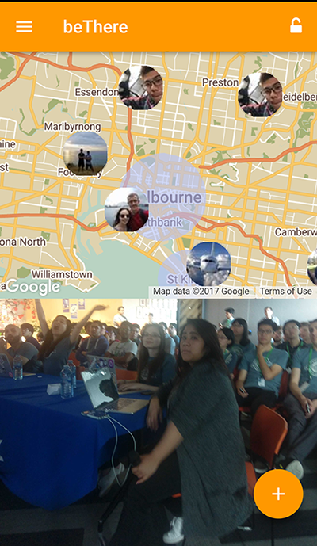

# Mobile Client for beThere
A geo-social app for immersive experience at festivals. 

> Honourable Mention at Facebook Melbourne Hackathon 2017



## Folder Structure
This is a web app bundled into apk using [Apache Cordova](http://cordova.apache.org/).


```
└─BeThereMobile
    ├─www
    │  ├─vendor      // external libs
    │  ├─scripts
    │  └─css     
    │     
    └─bin
       └─Android
          └─Debug   // built apk
```

## Frameworks used

 - Framework 7  - [Docs](http://framework7.io/docs/) 

## How to Build

 - Install [Visual Studio 2017](http://visualstudio.com/)
 - Select the `Mobile development with JavaScript` workload when installing
 - Open the solution file `BeThereMobile.sln`
 - Just build
 
> You can also just go into `BeThereMobile/www` and run `python -m SimpleHTTPServer` to run the web app locally.